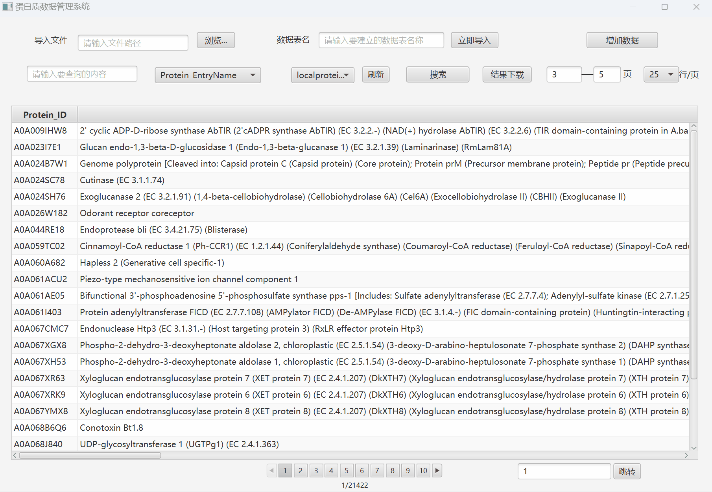

# 蛋白质数据管理系统项目开发文档

## 项目背景与目标
该项目旨在开发一个功能强大的数据库搜索应用，用于检索蛋白质数据库中的信息。通过该应用，用户可以轻松地搜索、导出和管理数据库中的数据。
- 提供一个用户友好的界面，使用户可以灵活地搜索和筛选数据库内容。
- 实现对大量数据的高效管理和显示，包括分页和导出功能。
- 提供跨数据库表的支持，使用户可以在不同的数据库表之间轻松切换。

## 0. 技术栈
- **JavaFX**：用于构建用户界面和实现交互功能。
- **Java数据库连接（JDBC）**：用于连接和操作数据库。
- **FXML**：用于界面设计。
- **SQLite**：用于存储和管理数据。

## 1. 程序的运行环境、安装步骤
1. 运行环境：JDK21
2. 程序组成部分：
    - `Bin_Project.jar`：可执行jar包文件
    - `ProteinDatabase.sqlite`：数据库文件
    - `README.md`：项目开发文档
3. 安装步骤
   1. 安装JDK21
   2. 将`Bin_Project.jar`和`ProteinDatabase.sqlite`文件放在同一目录下
   3. 双击运行`Bin_Project.jar`文件或打开命令行窗口，进入`Bin_Project.jar`所在目录，输入`java -jar Bin_Project.jar`命令运行程序
4. 源码编译运行步骤
   1. 安装JDK21
   2. 安装IntelliJ IDEA 2021.1(Ultimate Edition)
   3. 安装JavaFX 17.0.2
   4. 安装Scene Builder 17.0.0
   5. 安装SQLite 3.44.0
   6. 下载 `pom.xml` 文件中的依赖包
   7. 将可编译文件夹下 `ProteinDatabase.sqlite` 文件拷贝到项目目录下
   8. 打开IntelliJ IDEA 2021.1(Ultimate Edition)，点击“Open”按钮，选择项目所在目录，点击“OK”按钮
   9. 点击“Run”按钮，选择“Edit Configurations...”选项，点击“+”按钮，选择“Application”选项，点击“OK”按钮
   10. 在“Main class”输入框中输入`com.example.proteindatabase.Main`，点击“OK”按钮
   11. 点击“Run”按钮，即可运行程序

## 2. 程序开发平台
1. 代码行数：约 1500 行
2. 开发环境：IntelliJ 2023.1(Ultimate Edition) + JDK21 + Scene Builder 17.0.0 + SQLite 3.44.0 + JavaFX 17.0.2

## 3. 程序功能说明
1. 程序界面
   1. 程序整体界面如下图所示：
      
   2. 程序界面主要由以下部分组成：
      - **批量导入文件区**：包括浏览文件按钮和自定义数据表名输入框，用户可以点击浏览按钮选择文件，或者直接在导入文件框中输入文件路径；然后自定义新增数据的数据表名称，点击“立即导入”按钮完成导入工作。
      - **单个导入数据区**：包括数据库选择下拉框，用户可以在下拉框中选择要搜索的数据库。
      - **数据搜索输入区**：包括数据搜索输入框和搜索按钮，用户可以在输入框中输入要搜索的内容，然后点击搜索按钮进行搜索。
      - **数据表搜索列选择栏**：包括数据表选择下拉框和搜索列选择下拉框，用户可以在下拉框中选择要搜索的数据表和搜索列。
      - **刷新按钮**：用户可以点击刷新按钮刷新数据库内容，在批量导入数据后更新数据库中的所有数据表集合。
      - **结果下载区**：包括结果下载按钮、下载页面选择区，用户可以点击结果下载按钮导出所选页面的搜索结果，并支持自选csv、tsv等格式。
      - **单页显示条数选择栏**：包括单页显示条数选择下拉框，用户可以在下拉框中选择每页显示的数据条数。
      - **结果统计区**：包括结果统计标签，用户可以在结果统计标签中查看搜索结果的统计信息。
      - **结果显示区**：包括结果显示表格和分页栏，用户可以在结果显示表格中查看搜索结果，分页栏可以帮助用户翻页。
      - **页码跳转区**：包括页码输入框和跳转按钮，用户可以在页码输入框中输入要跳转的页码，然后点击跳转按钮跳转到指定页码。
2. 程序功能
   1. 将用户提供的文件或输入解析后存进数据库
      - 用户可以通过点击“浏览文件”按钮选择文件，或者直接在导入文件框中输入文件路径，输入批量导入数据的新建表明，然后点击“立即导入”按钮完成导入工作。
         
      - 用户也可以点击“增加数据”按钮，通过输入对应的蛋白质信息，将单个数据导入本地数据库。
         
   2. 按页浏览数据库收录的序列信息
      - 用户可以通过单页显示条数选择栏选择每页显示的数据条数，并通过分页栏进行翻页浏览；还可以通过页面跳转选项，跳转到指定的页面
         
      - 用户可以选择以文件形式保存多页数据，点击“结果下载”按钮，并可自选下载数据范围，自定义数据格式...
         
   3. 按关键字检索数据库收录的序列
      - 用户可以在下拉框中选择要搜索的数据库，同时在下拉框中选择搜索信息对应的列，然后在输入框中输入要搜索的内容，点击搜索按钮进行搜索。
         
         
      - 用户可以在搜索出期待结果后点击“结果下载”按钮，将搜索结果导出为csv或tsv格式的文件。

## 4. 项目结构
- 本项目的结构如下图所示：
~~~plantuml
└─main
    ├─java
    │  └─com
    │      └─example
    │          └─proteindatabase
    │              │  FakeMain.java
    │              │  Main.java
    │              │
    │              ├─controllers
    │              │      DataImportController.java
    │              │      DataInsertController.java
    │              │      DataSearchController.java
    │              │      MainWindowController.java
    │              │
    │              ├─database
    │              │      Database.java
    │              │      DatabaseManager.java
    │              │      DataTransformer.java
    │              │
    │              ├─models
    │              │      DataInsertNotofication.java
    │              │      DownloadCompleteNotification.java
    │              │      TableCreatedNotification.java
    │              │
    │              └─utils
    │                     ErrorDisplay.java
    │                     FileHandle.java
    │                     SearchResultHandle.java
    │                     StringUtil.java
    └─resources
        └─com
           └─example
               └─proteindatabase
                   └─fxml
                           DataImport.fxml
                           DataInsert.fxml
                           DataSearch.fxml
                           MainWindow.fxml
~~~
- 本项目的结构说明如下：
  - `main`：包含了项目的主要代码，包括`controllers`、`database`、`models`、`utils`四个包。
    - `controller`：包含了项目的控制器代码，包括`DataImportController`、`DataInsertController`、`DataSearchController`、`MainWindowController`四个控制器。 
      - `DataImportController`：作为 `DataImport.fxml` 的控制器，包括对文件导入相关控件的操作和事件处理。
      - `DataInsertController`：作为 `DataInsert.fxml` 的控制器，包括对数据插入相关控件的操作和事件处理。
      - `DataSearchController`：作为 `DataSearch.fxml` 的控制器，包括对数据搜索相关控件的操作和事件处理。
      - `MainWindowController`：作为 `MainWindow.fxml` 的控制器。
    - `database`：包含了项目的数据库代码，包括`Database`、`DatabaseManager`、`DataTransformer`三个类。
      - `Database`：数据库的操作抽象类，包括新建数据表，导入数据，搜索数据，导出数据等功能。
      - `DatabaseManager`：实现了对数据库管理的操作的类，包括对数据表的创建、导入、搜索操作。
      - `DataTransformer`：实现了对数据的转换，包括对数据的读取、对数据的写入等功能。
    - `models`：包含了项目的模型代码，包括`DataInsertNotofication`、`DownloadCompleteNotification`、`TableCreatedNotification`三个类。
      - `DataInsertNotofication`：实现了对数据插入的通知，包括对数据插入的显示、对异常输入操作的报错提示等功能。
      - `DownloadCompleteNotification`：实现了对下载完成的通知，包括对下载完成的显示、对下载过程中遇到问题的提示等功能。
      - `TableCreatedNotification`：实现了对数据表创建的通知，包括数据表创建成功显示、对数据表创建的隐藏等功能。
    - `utils`：包含了项目的工具代码，包括`ErrorDisplay`、`FileHandle`、`SearchResultHandle`、`StringUtil`四个类。
      - `ErrorDisplay`：实现了对错误信息的显示，包括对错误信息的显示、对错误信息的隐藏等功能。
      - `FileHandle`：实现了对文件的操作，包括对文件的读取、对文件的写入等功能。
      - `SearchResultHandle`：实现了对搜索结果的处理，包括对搜索结果的显示、对搜索结果的导出等功能。
      - `StringUtil`：实现了对字符串的处理，包括对字符串的分割、对字符串的拼接等功能。
    - `fxml`：包含了项目的视图代码，包括`DataImport.fxml`、`DataInsert.fxml`、`DataSearch.fxml`、`MainWindow.fxml`四个视图。
      - `DataImport.fxml`：实现了数据导入的视图板块，包括浏览文件按钮、自定义数据表名输入框、立即导入按钮等功能。
      - `DataInsert.fxml`：实现了数据插入的视图板块，包括数据库选择下拉框、增加数据按钮等功能。
      - `DataSearch.fxml`：实现了数据搜索的视图板块，包括数据搜索输入框、搜索按钮、数据表搜索列选择栏、刷新按钮、结果下载区、单页显示条数选择栏、结果统计区、结果显示区、页码跳转区等功能。
      - `MainWindow.fxml`：实现了主窗口的视图板块。

## 5. 项目亮点
- **用户友好的界面**：使用 JavaFX 开发了用户友好的界面，使用多种功能控件实现清晰完善的功能显示；同时尽可能在界面中隐式描述用户输入格式，使用户能够轻松地搜索和导出数据。
- **多数据库表支持**：实现了对多种数据库表的支持，用户可以轻松切换不同的数据库表进行搜索，同时便于用户对蛋白质的不同特性进行管理与查看。
- **自定义文件导入格式**：实现了对用户自定义文件导入TSV、CSV等格式的支持，使用户能够更加灵活地批量导入数据。
- **自定义数据表名称**：实现了对用户自定义数据表名称的支持，使用户能够更加灵活地批量导入数据。
- **自定义页面显示条数**：实现了对用户自定义页面显示条数的支持，使用户能够更加灵活地浏览数据。
- **动态数据显示**：利用 JavaFX 的 `Pagination` 控件，实现了对大量数据的动态分页显示，确保用户体验。
- **大量数据页面跳转**：实现了对大量数据的页面跳转功能，使用户能够快速跳转到指定页面。
- **按列选择搜索**：实现了对指定列的搜索功能，使用户能够更加灵活地搜索数据。
- **对搜索结果的统计**：实现了对搜索结果的统计功能，使用户能够更加直观地查看搜索结果。
- **对用户异常输入的有效检验**：实现了对用户异常输入的有效检验与提示，使用户能够更加方便地输入数据。
- **对模糊搜索和精确搜索的自动支持**：实现了对模糊搜索和精确搜索的支持，使用户能够更加灵活地搜索数据。
- **数据导出功能**：开发了导出功能，使用户能够以 TSV 或 CSV 格式导出搜索结果，同时支持用户选择导出页面范围，方便进一步处理和分析。
- **运行环境要求低**：将所需的 JavaFX 等依赖包打包进可执行 jar 包中，使用户能够在仅安装JDK21，无需安装 JavaFX 等依赖包的情况下运行程序。

## 6. 开发过程中遇到的挑战与解决方法
在项目开发过程中，面临了多种挑战，包括但不限于：
1. 数据库连接和查询方向
   1. 关键点：如何连接和查询数据库，如何避免SQLite锁定的问题，并确保正确和高效地执行查询操作。
      解决方案：使用JDBC连接SQLite内嵌式数据库，使用 `PreparedStatement` 预编译SQL语句，使用 `ResultSetMetaData` 获取数据库表的列信息，借助SQLite的 `rowid` 进行分页查询，使用SQLite的 `PRAGMA read_uncommitted = true` 语句避免SQLite锁定的问题。同时在每个数据库指令功能执行结束后及时关闭数据库连接，确保数据库的正确关闭，减少对内存性能的占用。
   2. 关键点：如何实现对多种数据库表的支持，如何确保在界面上的高效加载和显示。
      解决方案：使用JavaFX的 `Pagination` 控件实现分页数据显示，同时在 `DataSearchController` 类中初始化添加监视器，确保用户选择不同数据表时及时更新 `Pagination` 控件列名。 
2. 界面设计与交互方向
   1. 关键点：如何根据搜索出的结果数量及时更新 `Pagination` 控件的页数。
      解决方案：利用 `Pagination` 控件的 `pageCountProperty` 属性，在用户执行搜索操作后 `unbind`(解绑) 控件页数信息更新页数，之后再进行页面显示，以达成可视化搜索结果多少的观感。
   2. 关键点：如何初始化显示本地数据库的内容。
      解决方案：在 `DataSearchController` 类中实现 `Initializable` 接口，使用 `initialize()` 方法初始化显示本地数据库的内容，使用 `Platform.runLater()` 方法确保在主线程中执行初始化操作，以确保初始化操作的正确执行
   3. 关键点：如何处理用户异常输入与错误操作，并在成功操作后及时提示。
      解决方案：使用 `try-catch` 语句捕获用户异常输入与错误操作，使用 `Alert` 控件弹出提示框，提示用户输入错误或操作完成信息。或者借助 `Label` 控件，使用 `setVisible()` 方法在用户输入错误时显示提示信息。
3. 数据导出方向
   1. 关键点：如何实现对搜索结果的导出，如何实现对导出格式的选择。
      解决方案：使用 `FileChooser` 控件实现文件选择功能，使用 `FileWriter` 实现数据导出功能，使用 `CSVWriter` 实现对CSV格式的支持，使用 `TSVWriter` 实现对TSV格式的支持。
   2. 关键点：如何实现对导出页面范围的选择。
      解决方案：使用 `ChoiceBox` 控件实现对导出页面范围的选择，使用 `ObservableList` 实现对页面范围的存储，使用 `for` 循环实现对页面范围的选择。
   3. 关键点：如何处理导入内容中有空缺内容可能导致index超限的问题。
      解决方案：使用 `try-catch` 语句捕获用户异常操作，遇到空缺内容时及时使用 `null` 补充以避免index超限的问题。

## 7. 总结
在项目开发过程中，我克服了众多挑战，并不断优化和改进应用，以实现更好的用户体验。这个应用不仅能够有效管理大量数据，而且提供了直观友好的界面，使用户能够轻松搜索和导出数据。
